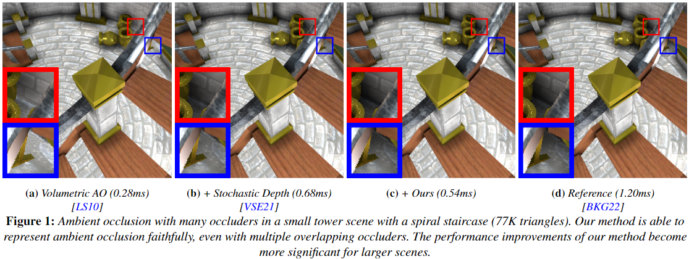

# Ray Traced Stochastic Depth Map for Ambient Occlusion

Teaser:

## Contents:

* [Demo User Interface](#demo-user-interface)
* [Additional Videos](#additional-videos)
* [Falcor Prerequisites](#falcor-prerequisites)
* [Building Falcor](#building-falcor)

## Demo User Interface

This project was implemented in NVIDIAs Falcor rendering framework.

You can download the executable demo from the releases page TODO Link, or build the project by following the instructions in [Building Falcor](#building-falcor).

After downloading the demo from the releases page, you can execute it with the RunFalcor.bat file. In the Demo, you can select between 4 outputs with the dropdown:
* ShadedTAA: AO + shading + Temporal Anti-Aliasing
* AmbientOcclusionTAA: AO + Temporal Anti-Aliasing
* Shaded: AO + shading
* AmbientOcclusion: AO

To change settings of our algorithms, navigate to the SVAO group below and expand it.

You can navigate the camera with WASD and dragging the mouse for rotation.

## Additional Videos

### Sun Temple

VAO (Halo): https://www.youtube.com/watch?v=tM9FI8GIJqU

1/4 Ray-SD: https://www.youtube.com/watch?v=sWEYIxme968

1/4 Ray-SD AO: https://www.youtube.com/watch?v=SExqcEixvLo

### Bistro

VAO (Halo): https://www.youtube.com/watch?v=Cw6GU3lJns8

1/4 Ray-SD: https://www.youtube.com/watch?v=PIQo2_nakQA

1/4 Ray-SD AO: https://www.youtube.com/watch?v=wcSHOUG8qdQ

### Emerald Square

VAO (Halo): https://www.youtube.com/watch?v=fqmz91wBeiA

1/4 Ray-SD: https://www.youtube.com/watch?v=vHRyg8kd2Yg

1/4 Ray-SD AO: https://www.youtube.com/watch?v=PHAlVU92CHU

## Falcor Prerequisites
- Windows 10 version 20H2 (October 2020 Update) or newer, OS build revision .789 or newer
- Visual Studio 2022
- [Windows 10 SDK (10.0.19041.0) for Windows 10, version 2004](https://developer.microsoft.com/en-us/windows/downloads/windows-10-sdk/)
- A GPU which supports DirectX Raytracing, such as the NVIDIA Titan V or GeForce RTX
- NVIDIA driver 466.11 or newer

Optional:
- Windows 10 Graphics Tools. To run DirectX 12 applications with the debug layer enabled, you must install this. There are two ways to install it:
    - Click the Windows button and type `Optional Features`, in the window that opens click `Add a feature` and select `Graphics Tools`.
    - Download an offline package from [here](https://docs.microsoft.com/en-us/windows-hardware/test/hlk/windows-hardware-lab-kit#supplemental-content-for-graphics-media-and-mean-time-between-failures-mtbf-tests). Choose a ZIP file that matches the OS version you are using (not the SDK version used for building Falcor). The ZIP includes a document which explains how to install the graphics tools.
- NVAPI, CUDA, OptiX (see below)

## Building Falcor
Falcor uses the [CMake](https://cmake.org) build system. Additional information on how to use Falcor with CMake is available in the [CMake](docs/development/cmake.md) development documetation page.

### Visual Studio
If you are working with Visual Studio 2022, you can setup a native Visual Studio solution by running `setup_vs2022.bat` after cloning this repository. The solution files are written to `build/windows-vs2022` and the binary output is located in `build/windows-vs2022/bin`.
